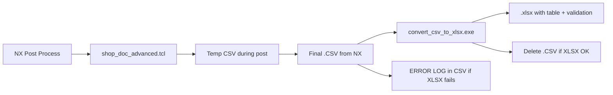

# shop_doc_advanced — Siemens NX Post-Processor

Custom CAM post-processor for **Siemens NX** (Design Center / NX 2512 tested) that exports **shop documentation** as CSV and converts it to a formatted **Excel workbook (.xlsx)** for planners and operators.

Built with **Post Builder** for a **5-axis dual-table** mill. Primary output is a parameter spreadsheet (tool, material, strategy, stepover, stock, cycle time, etc.) rather than traditional G-code listing.

---

## Features

| Area | Description |
|------|-------------|
| **Shop-doc CSV** | One row per tool path with fixed shop columns plus NX `mom_*` cutting parameters |
| **XLSX conversion** | Self-contained `convert_csv_to_xlsx.exe` (ClosedXML 0.105) — **no Microsoft Excel**, no COM, no `cscript` |
| **Table styling** | Dark Teal, **Table Style Medium 9**, autofilter, frozen header row/column |
| **Data validation** | Dropdown lists on Material Type, Cutter Type, Tool Type, Finish Type, Machining Type (Conventional/HSM) |
| **Conditional formatting** | Blank cells in those columns → yellow fill + red border |
| **Safe overwrite** | If `PartName.xlsx` exists, saves as `PartName_1.xlsx`, then `_2`, … (never overwrites) |
| **Error log** | Optional diagnostics appended to output (see below) |
| **Guest / offline** | No admin rights, no Office license, no network required at runtime |
| **CSV-only mode** | Optional env var to skip motion output for faster posts on huge toolpaths |

---

## Output workflow



1. During the post, cutting data is written to a temp CSV (`*_shopdoc_tmp.csv`).
2. At **end of program**, that data replaces the NX `.CSV` output file.
3. `convert_csv_to_xlsx.exe` builds the Excel file next to the CSV.
4. On success, the CSV is removed; on failure, the CSV remains with an **ERROR LOG** section at the bottom.

---

## Repository layout

### Deploy to NX (end users)

Copy these files into your NX post-processor folder (same directory):

```
shop_doc_advanced/
├── shop_doc_advanced.tcl      # Main post (required)
├── shop_doc_advanced.def      # Post definition (required)
├── shop_doc_advanced.pui      # Post UI / units (required if used in Post Builder)
├── shop_doc_advanced.cdl      # Custom definition (if referenced by your install)
└── convert_csv_to_xlsx.exe    # XLSX converter (~38 MB, self-contained)
```

Example NX path:

```text
C:\Program Files\Siemens\DesigncenterNX2512\mach\resource\postprocessor\shop_doc_advanced\
```

**Do not deploy** the `DEV_ONLY` folder to shop-floor PCs.

### Development only (`DEV_ONLY/`)

| Item | Purpose |
|------|---------|
| `ConvertCsvToXlsx/` | C# source (ClosedXML converter) |
| `build_converter.ps1` | Builds exe and copies it to post root |
| `fix_after_pb_save.ps1` / `.bat` | Re-applies trace patch after Post Builder save |
| `diagnose_postprocessor.ps1` | Checks stuck processes, temp files, converter deploy |

---

## Installation (NX)

1. Copy the **deploy** files above into a folder under `UGII_CAM_POST_DIR` (or your site post path).
2. In NX: **File → Utilities → Post Processor** (or CAM **Post Process**).
3. Select post name **`shop_doc_advanced`**.
4. Set output directory to a folder the user can **write** (local disk recommended; avoid locked network paths if possible).
5. Post the program — you should get `.xlsx` (and briefly `.csv` if conversion fails).

### Registering in Post Builder (maintainers)

1. Open Post Builder and load `shop_doc_advanced`.
2. After saving from Post Builder, run:

   ```powershell
   powershell -ExecutionPolicy Bypass -File DEV_ONLY\fix_after_pb_save.ps1
   ```

   This re-inserts the `mom_stepover_distance` trace lines that Post Builder strips from `MOM_start_of_program`.

---

## Runtime requirements (shop / guest users)

| Requirement | Notes |
|-------------|--------|
| Windows x64 | Converter is published for `win-x64` |
| Write access | Output folder for `.csv` / `.xlsx` |
| Read access | Post folder (`.tcl` + `.exe`) |
| **Not** required | Admin, Excel, Office, .NET SDK, internet, `cscript.exe` |

Antivirus or OneDrive on the output folder can slow saves or lock files — use a local writable path if issues occur.

---

## Configuration (`shop_doc_advanced.tcl`)

Near the top of the post file:

```tcl
set mom_sys_csv_to_xlsx_enabled     1   ;# 0 = CSV only, no XLSX
set mom_sys_csv_error_log_enabled   1   ;# 0 = no ERROR LOG appendix
set mom_sys_converter_dir           $mom_sys_this_post_dir
```

| Variable | Default | Meaning |
|----------|---------|---------|
| `mom_sys_csv_to_xlsx_enabled` | `1` | Run converter at end of post |
| `mom_sys_csv_error_log_enabled` | `1` | Append ERROR LOG table to CSV on failure or for diagnostics |
| `mom_sys_converter_dir` | Post directory | Folder containing `convert_csv_to_xlsx.exe` |

### Environment variables

| Variable | Effect |
|----------|--------|
| `MOM_CSV_ONLY=1` | Skip G-code motion output; only shop CSV data (faster on large programs) |
| `PB_SUPPRESS_UGPOST_DEBUG=1` | Standard NX post debug suppression |

---

## Excel output details

### Shop columns (first columns in sheet)

Includes: No., A/C Type, Part Number, Material Type, Tool Ref. Number, Cutter Description, Cutter Type, Tool Type, Finish Type, feeds/speeds, DOC, strategy, operation name, plus many NX parameter columns (`mom_*`, `path_stepover_*`, etc.).

### Data validation lists

Defined in `DEV_ONLY/ConvertCsvToXlsx/Program.cs` (rebuild exe after edits):

| Column | Allowed values |
|--------|----------------|
| Material Type | Aluminium, Titanium, Steel, Bronze |
| Cutter Type | End Milling, Face Milling, Drilling, Reaming, Turning |
| Tool Type (Carbide/HSS/PCD) | Carbide, HSS, PCD |
| Finish Type | Finish, Controlled Roughing, Free Roughing |
| Machining Type (Conventional/HSM) | Conventional, HSM |

- Dropdown on each data row; blanks allowed.
- **Stop** alert if user types a value not in the list.
- No popup when merely selecting a cell (input message disabled).

### Conditional formatting

On the same five columns, **blank** cells get **yellow fill** and **red outline**.

### Auto-rename

| Requested file | If exists | Next file |
|----------------|-----------|-----------|
| `Job.xlsx` | yes | `Job_1.xlsx` |
| `Job_1.xlsx` | yes | `Job_2.xlsx` |

The post reads the actual path from the converter `SUCCESS:` line and reports it in the listing comment.

---

## Building the converter (developers)

**Prerequisites:** .NET 8 SDK on a dev PC.

From the repository root:

```powershell
powershell -ExecutionPolicy Bypass -File DEV_ONLY\build_converter.ps1
```

This publishes a **self-contained single-file** `convert_csv_to_xlsx.exe` to the post root. Copy that exe to all NX post deployments.

Manual publish:

```powershell
dotnet publish DEV_ONLY\ConvertCsvToXlsx\ConvertCsvToXlsx.csproj -c Release -o DEV_ONLY\ConvertCsvToXlsx\bin\publish
```

---

## ERROR LOG

When `mom_sys_csv_error_log_enabled` is `1`, the post collects messages during the run. If conversion fails (or for audit), three blank rows and an **ERROR LOG** table are appended to the CSV with columns:

`Timestamp | Level | Category | Message`

Typical categories: `System`, `Paths`, `Permission`, `Deploy`, `CSV`, `XLSX`, `Runtime`, `Converter`.

Use this table first when troubleshooting guest-machine issues.

---

## Troubleshooting

### XLSX not created

1. Open the `.CSV` (if present) and scroll to **ERROR LOG**.
2. Confirm `convert_csv_to_xlsx.exe` is next to `shop_doc_advanced.tcl`.
3. Confirm output folder is writable (not read-only, not blocked by policy).
4. Re-deploy exe from a fresh `build_converter.ps1` run.

### Converter fails immediately (`The handle is invalid`)

Fixed in current exe: do not set console encoding when NX launches the process without a console. Update `convert_csv_to_xlsx.exe`.

### Post gets slower after many runs

Usually **orphaned `EXCEL.EXE`** from old VBS/COM converter — not applicable after ClosedXML migration. To check legacy issues:

```powershell
powershell -ExecutionPolicy Bypass -File DEV_ONLY\diagnose_postprocessor.ps1
```

### Validation or formatting wrong after code changes

Edit `DEV_ONLY/ConvertCsvToXlsx/Program.cs`, rebuild, redeploy exe only (TCL unchanged unless post logic changed).

### Post Builder overwrote custom TCL

Run `DEV_ONLY\fix_after_pb_save.ps1` after saving in Post Builder.

---

## Machine / kinematics

| Setting | Value |
|---------|--------|
| Machine type | `5_axis_dual_table` |
| 4th axis | Table, leader `A` |
| 5th axis | Table, leader `C` |
| Output units | MM (alternate IN fragment available via `shop_doc_advanced__IN.pui`) |

Adjust kinematics in Post Builder or `shop_doc_advanced.tcl` / `.pui` for your physical machine.

---

## License

MIT License — see [LICENSE](LICENSE). Copyright (c) 2026 HakimHisham1991.

Third-party: [ClosedXML](https://github.com/ClosedXML/ClosedXML) 0.105 (MIT) bundled inside `convert_csv_to_xlsx.exe`.

---

## Quick reference

| Task | Command / action |
|------|------------------|
| Build converter | `DEV_ONLY\build_converter.ps1` |
| Fix after Post Builder | `DEV_ONLY\fix_after_pb_save.ps1` |
| Diagnose slowdown / deploy | `DEV_ONLY\diagnose_postprocessor.ps1` |
| Disable XLSX | `set mom_sys_csv_to_xlsx_enabled 0` in `.tcl` |
| Fast post (CSV data only) | Set env `MOM_CSV_ONLY=1` before starting NX |
